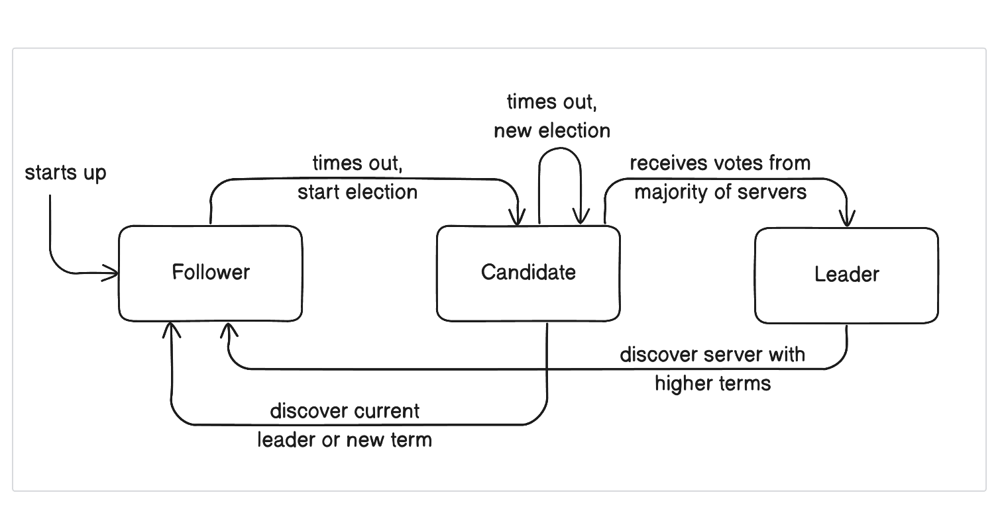

# RAFT

> It is the Raft Consensus algorithm Raft implemented in Go.

## Raft Protocol Description 

> Raft nodes exist in one of three states: `follower`, `candidate`, or `leader`. All nodes begin as followers, where they can accept log entries from a leader and cast votes. If no entries arrive, nodes switch to candidates, seeking votes from peers. With a quorum of votes, a candidate becomes a leader. Leaders manage log entries and replicate to followers, also handling queries for real-time data.

Once a cluster has a leader, it can take new log entries. Clients can ask the leader to append entries, which are opaque data to Raft. The leader stores entries, replicates to followers, and after commit, applies them to a finite state machine (FSM). The FSM, tailored to each application, is implemented using an interface.

Addressing the growing log issue, Raft snapshots the current state and compacts logs. Because restoring FSM state must match log replay, logs leading to a state are removed automatically, averting infinite disk usage and minimizing replay time.

Updating the peer set for new or leaving servers is manageable with a quorum. Yet, a challenge arises if quorum isn't attainable. For instance, if only A and B exist, and one fails, quorum isn't possible. Thus, the cluster can't add/remove nodes or commit entries, causing unavailability. Manual intervention to remove one node and restart the other in bootstrap mode is needed to recover.

In essence, Raft ensures consensus among nodes by transitioning states, enabling log management, and addressing membership changes, all while striving to maintain availability and reliability.

## Working 

- Creates a simulated network with the specified nodes and initializes channels for message communication.

```go
func CreateNetwork(nodes ...int) *network {
	nt := network{recvQueue: make(map[int]chan Message, 0)}

	for _, node := range nodes {
		nt.recvQueue[node] = make(chan Message, 1024)
	}

	return &nt
}

```
- Initializes a new Raft server/node with a given ID, role (Follower, Candidate, Leader), communication network, and list of other nodes in the cluster.

```go
func NewServer(id int, role Role, nt nodeNetwork, nodeList ...int) *RaftServer {
	rand.Seed(time.Now().UnixNano())
	expiredMiliSec := rand.Intn(5) + 1
	serv := &RaftServer{id: id,
		role:        role,
		nt:          nt,
		expiredTime: expiredMiliSec,
		isAlive:     true,
		nodeList:    nodeList,
		db:          submittedItems{}}
	go serv.runServerLoop()
	return serv
}

```

- `runServerLoop()`The main loop of the Raft server that continuously handles its state based on its role (Follower, Candidate, Leader).

```go
func (sev *RaftServer) runServerLoop() {

	for {
		switch sev.role {
		case Leader:
			sev.runLeaderLoop()
		case Candidate:
			sev.runCandidateLoop()
		case Follower:
			sev.runFollowerLoop()
		}

		//timer base on milli-second.
		time.Sleep(100 * time.Millisecond)
	}
}
```

-  Sends heartbeats from the leader to its followers.
```go
func (sev *RaftServer) sendHearbit() {
	latestData := sev.db.getLatestLogs()
	for _, node := range sev.nodeList {
		hbMsg := Message{from: sev.id, 
        to: node, 
        typ: Heartbit, 
        val: *latestData}
		sev.nt.send(hbMsg)
	}
}
```

- `majorityCount()` : Calculates the majority count needed for reaching consensus in the Raft algorithm.

```go
func (sev *RaftServer) majorityCount() int {
	return len(sev.nodeList)/2 + 1
}

```

- `roleChange(newRole Role)`: Changes the role of the Raft server and logs the role change.

```go
func (sev *RaftServer) roleChange(newRole Role) {
	log.Println("note:", sev.id, 
    " change role from ", sev.role,
    " to ", newRole)
	sev.role = newRole
}
```
---

### Simulation

- A network (`nt`) is created with nodes `1`, `2`, `3`, `4`, and `5`.
- Five Raft server instances (`nServer1` to `nServer5`) are created, each with a specific `ID`, `role` (Follower), and list of connected `nodes`.
- The server instances are set to Follower roles initially.

### Leader Election Simulation

- Server 1 (`nServer1`) is assigned an entry in its log using the `AppendEntries` method.
- A loop is started that checks the role of `nServer1` repeatedly. If it becomes a `leader` within the loop, the loop exits.

Now, let's walk through the leader election process:
- Server 1 (`nServer1`) is assigned an entry in its log. It is in the Follower state initially.
- It will start sending RequestVote messages to other nodes because it's a candidate now.
- As other servers receive the RequestVote message from Server 1, they will respond with AcceptVote messages.
- Once Server 1 receives AcceptVote messages from a majority of nodes (3 out of 5), it changes its role to Leader and sends WinningVote messages to other nodes to notify them of its victory.

```go
func main() {

	.
	.
	.
	.

	// rest of the code

	nt := CreateNetwork(1, 2, 3, 4, 5)
	nServer1 := NewServer(1, Follower, 
		nt.getNodeNetwork(1), 2, 3, 4, 5)
	nServer2 := NewServer(2, Follower, 
		nt.getNodeNetwork(2), 1, 3, 4, 5)
	nServer3 := NewServer(3, Follower, 
		nt.getNodeNetwork(3), 2, 1, 4, 5)
	nServer4 := NewServer(4, Follower, 
		nt.getNodeNetwork(4), 2, 3, 1, 5)
	nServer5 := NewServer(5, Follower,
		nt.getNodeNetwork(5), 2, 3, 1, 5)

	...

	nServer1.AppendEntries(datalog{term: 1, action: "x<-1"})
	
	...

	for i := 0; i <= 10; i++ {
		if nServer1.Whoareyou() == Leader {
			log.Println("1 become leader done.")
			return
		}
		log.Println("1 still not leader:", nServer1.Whoareyou())
		time.Sleep(time.Second)
	}
}
```

## Running the Application

- First, ensure that your Go modules are up-to-date by running:

```bash
go mod tidy
```

- To run the application and store the output in a log file, use the following command:

```bash
go run main.go > output.log 2>&1
```

- If you are using Docker, you can run your application in a container. Follow these steps:
	-  Build a Docker image for your application
	- Run the Docker container and store the output in a log file

```bash
docker build --tag raft .     
docker run -it raft > output.log 2>&1  
```

## Explanation



Server states involve a system where certain servers, known as `followers`, are designed to only react to requests originating from other servers. In this setup, if a `follower` server remains inactive and does not receive any form of communication for a certain period, it transitions into a candidate state. This `candidate` server then takes the initiative to initiate an election process.

During the election, the `candidate` server seeks support from its peers within the cluster. To become the new `leader`, a `candidate` must garner votes from more than half of the total servers in the cluster, establishing a majority consensus. Once a `candidate` successfully collects enough votes and achieves this majority threshold, it assumes the role of the new `leader` server.

Leadership within this framework is characterized by stability until a leader server encounters a failure or experiences some sort of issue that prevents it from functioning properly. Upon such an event, the system would then trigger a new election process to identify and establish a successor leader server, ensuring the continued operational integrity of the system.

### Reference 

- [Raft Research Paper](https://raft.github.io/raft.pdf)
